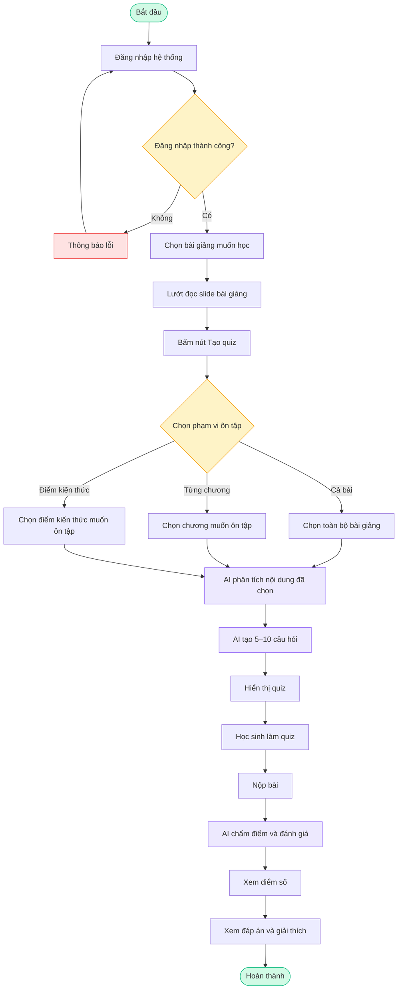

# Workflow trợ lý AI tạo quiz từ slide bài học

```mermaid
flowchart TD
    A([Bắt đầu]) --> B[Đăng nhập hệ thống]
    B --> C{Đăng nhập thành công?}

    C -- Không --> D[Thông báo lỗi]
    D --> B
    C -- Có --> E[Chọn bài giảng muốn học]

    E --> F[Lướt đọc slide bài giảng]
    F --> I[Bấm nút Tạo quiz]
    I --> S{Chọn phạm vi ôn tập}

    S -- Cả bài --> T[Chọn toàn bộ bài giảng]
    S -- Từng chương --> U[Chọn chương muốn ôn tập]
    S -- Điểm kiến thức --> V[Chọn điểm kiến thức muốn ôn tập]

    T --> J[AI phân tích nội dung đã chọn]
    U --> J
    V --> J
    J --> K[AI tạo 5–10 câu hỏi]
    K --> L[Hiển thị quiz]

    L --> M[Học sinh làm quiz]
    M --> N[Nộp bài]
    N --> O[AI chấm điểm và đánh giá]

    O --> P[Xem điểm số]
    P --> Q[Xem đáp án và giải thích]
    Q --> R([Hoàn thành])

    style A fill:#d1fae5,stroke:#10b981
    style R fill:#d1fae5,stroke:#10b981
    style C fill:#fef3c7,stroke:#f59e0b
    style S fill:#fef3c7,stroke:#f59e0b
    style J fill:#ede9fe,stroke:#8b5cf6
    style K fill:#ede9fe,stroke:#8b5cf6
    style O fill:#ede9fe,stroke:#8b5cf6
    style D fill:#fee2e2,stroke:#ef4444
```

Luồng chính: **Đăng nhập → Chọn bài giảng → Đọc slide → Chọn phạm vi ôn tập → Tạo quiz → Làm quiz → AI chấm điểm → Xem kết quả và đánh giá.**
